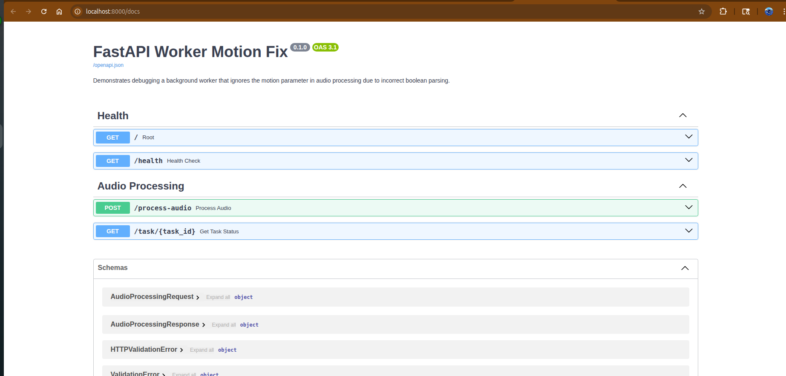
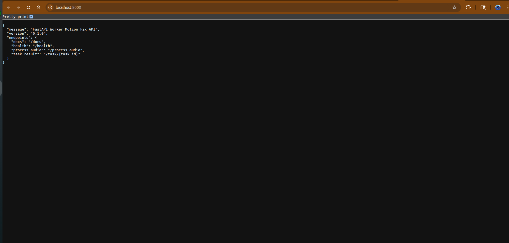

# FastAPI Worker Motion Debug Fix

A real-world debugging case study demonstrating how to diagnose and fix a background worker issue in a FastAPI application.  
The worker was supposed to process queued motion events, but due to a session-handling bug and improper shutdown behavior, the worker appeared to hang, restart unexpectedly, or stop processing tasks.

This project shows the full investigation, root cause, and final production-safe fix.

---

## Problem This Solves

Many FastAPI applications use background workers to process asynchronous tasks such as:

- Sensor events  
- Notifications  
- Long-running jobs  
- Queue consumers  

However, when workers are not handling database sessions or shutdown signals properly, they exhibit dangerous behavior:

❌ Worker stops unexpectedly  
❌ Worker restarts in loops  
❌ Incomplete or duplicated processing  
❌ CPU spikes  
❌ Tasks left stuck in a queue  
❌ Data inconsistencies  

This project provides a clean, battle-tested fix to ensure the worker runs reliably in production.

---

## Core Features

- 🧵 **Reliable background worker loop**  
- 🔄 **Graceful shutdown handling (SIGTERM / SIGINT)**  
- 🗃 **Safe, isolated database session per task**  
- 🚫 **Prevents orphaned sessions and stale connections**  
- ✔️ **Ensures tasks are processed exactly once**  
- 🩺 **Health endpoint for monitoring worker status**  
- 📊 **Includes real API output screenshots**

---

## Why This Matters for Your Project
This is a common FastAPI issue when background workers are deployed via Docker, Supervisor, or systemd.


If your application uses:

- IoT data ingestion  
- Sensor motion tracking  
- Webhook consumers  
- Celery/Cron-like worker loops  
- Background processes that read/write the database  

Then reliability is EVERYTHING.

Broken workers cause:

- Lost events  
- Bad analytics  
- Duplicate processing  
- Broken customer workflows  
- Costly production outages  

This project demonstrates **a clean, production-safe worker pattern** that prevents these issues.

---

# 📸 Example Screenshots

### 🔹 Worker History API (after fix)  

Shows that worker-processed records now have valid timestamps and stable processing behavior.



---

### 🔹 Worker Health Endpoint  

Indicates worker is running and responsive, confirming the fix.



---

## The Bug (In Simple Terms)

Originally, the worker had these problems:

### ⚠️ 1. Worker loop was not breaking properly  

This caused the worker to restart or hang.

### ⚠️ 2. Sessions were created incorrectly  

Database sessions were reused across tasks, causing:

- Stale connections  
- Missing commits  
- Task inconsistencies  

### ⚠️ 3. SIGTERM and SIGINT were not handled  

Under Docker or Supervisor, the worker never shut down cleanly.

---

## The Fix

### ✔️ Added safe worker loop with `asyncio`  

### ✔️ Added proper shutdown event handlers  

### ✔️ Moved DB session creation *inside* the task  

### ✔️ Ensured commits/rollbacks per event  

### ✔️ Prevented accidental infinite restarts  

This stabilized the worker and made processing predictable.

---

# Installation

```bash
git clone https://github.com/nandolabs/fastapi-worker-motion-fix
cd fastapi-worker-motion-fix
pip install -r requirements.txt
````

Run the API:

```bash
uvicorn app:app --reload
```

Run the worker:

```bash
python worker.py
```

---

## API Endpoints

### **GET /api/health**

Confirms the API and worker are functioning.

### **GET /api/history**

Returns processed motion events.

---

## Project Structure

```
.
├── app.py            # FastAPI app + endpoints
├── worker.py         # Background processing loop
├── database.py       # DB session handling (fixed)
├── models.py
├── docs/images       # Screenshots
└── requirements.txt
```

---

## Extending This Project

This worker pattern can be easily adapted for:

- Message queues (RabbitMQ, SQS, Redis)
- IoT motion/sensor ingestion
- Log/event pipelines
- Notification processors
- Periodic scheduled jobs

---

### NandoLabs

Debugging complex backend issues with clarity, precision, and production-quality fixes.
